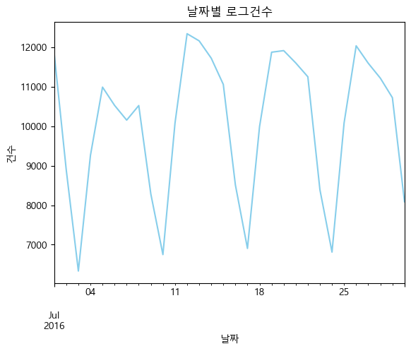
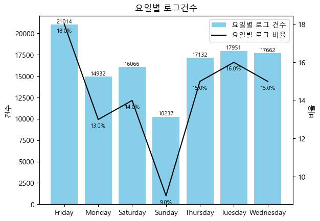

# 로그 분석을 통한 유저 행동 분석

### 1 프로젝트 소개
1.1 프로젝트 개요   
* 로그 분석을 통해 웹 및 앱 애플리케이션의 사용자 행동 및 패턴을 이해하고 이를 바탕으로 애플리케이션 개선을 위한 액션을 도출하고자함.
    
1.2 프로젝트 소개
* 프로젝트 기간 : 2023.07.17 - 2023.07.21
* 기술 스택 : ```Python```
* 1인 프로젝트

<br> 
  
### 2 프로젝트 진행절차
2.1 데이터 소개
* 데이터 shape : 301861 rows × 7 columns
* columns : actiontype(문서 이용시 행동), ismydoc(내문서 해당 여부), ext(문서 확장자), sessionid(유저 식별자), documentposition(문서 이용시 위치 정보), datetime(날짜), screen(페이지 이름)
* 출처 : GitHub
  
2.2 데이터 전처리
* datetime은 datetime으로 타입 변환.
* 요일 컬럼 생성.
* sessionid의 경우 보기 쉽게 int로 변경.  
  
* 세션의 경우 시간이 나타나 있지 않고 날짜만 존재하기 때문에 재정의는 하지 않고 분석 진행


2.3 EDA
* 날짜별 로그 건수에서 패턴이 보이며 주로 주말(23%)보다는 평일(77%)에 높음
<table>
  <tr>
    <td>
      
    </td>
    <td>
      
    </td>
  </tr>
</table>
<table>
  <tr>
    <td>
      
    </td>
  </tr>
</table>

### 3. 결론
### 4. 한계점 및 개선사항
* 한계점
  * 2016년 7월의 데이터만 존재하고 시간 데이터는 존재하지 않는점.
* 개선사항
  * 추후에 직접 로그 데이터를 수집하여 분석 예정
