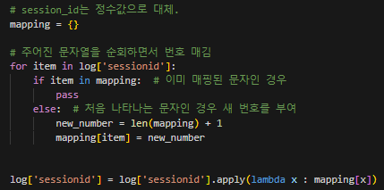
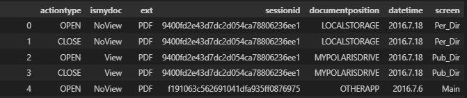
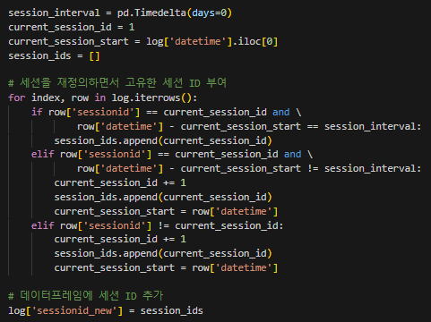
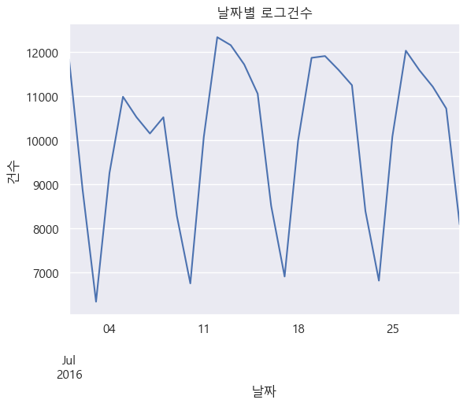
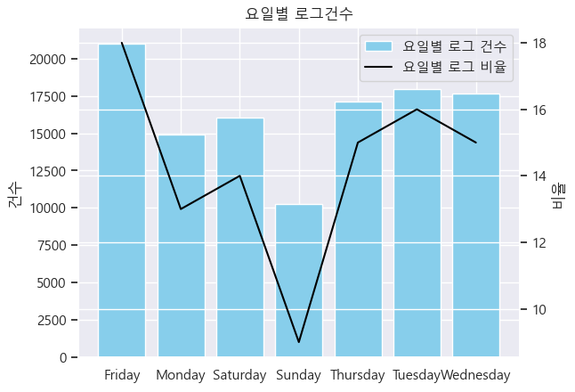
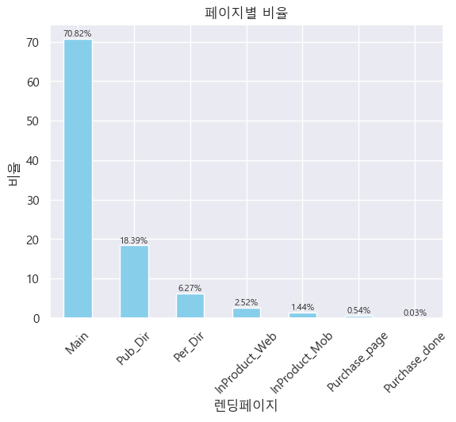
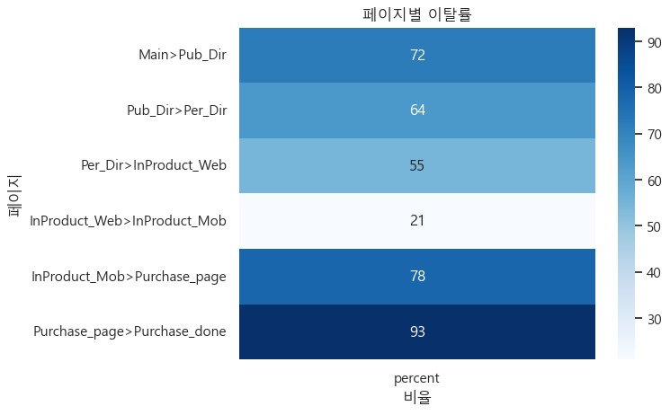
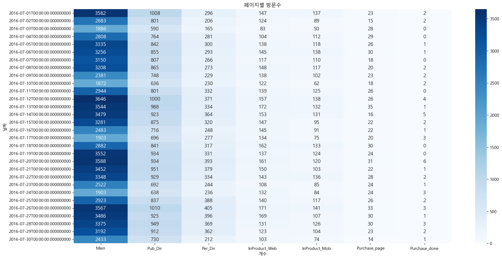

# 로그 분석을 통한 유저 행동 분석

### 1 프로젝트 소개
1.1 프로젝트 배경  
* 로그 분석을 통해 웹 및 앱 애플리케이션의 사용자 행동 및 패턴을 이해하고 이를 바탕으로 애플리케이션 개선을 위한 액션을 도출하고자함.

1.2 프로젝트 소개
* 프로젝트 기간 : 2023.07.17 - 2023.07.21
* 프로젝트 키워드 : ```전처리``` ```EDA``` ```퍼널분석``` ```통계분석```
* 기술 스택 : ```Python``` 
* 1인 프로젝트

<br> 

### 2 프로젝트 진행절차
2.1 데이터 소개
* 데이터 shape : 301861 rows × 7 columns
* columns : actiontype(문서 이용시 행동), ismydoc(내문서 해당 여부), ext(문서 확장자), sessionid(유저 식별자), documentposition(문서 이용시 위치 정보), datetime(날짜), screen(페이지 이름)



* 출처 : GitHub

2.2 데이터 전처리
* datetime은 datetime으로 타입 변환.
* 요일 컬럼 생성.
* sessionid의 경우 보기 쉽게 int로 변경.  

<<<<<<< HEAD
* 세션 재정의
  * 보통 세션은 30분을 기준으로 하지만 해당 데이터에서는 시간이 아닌 날짜만 존재하기 때문에 0일을 기준으로 세션 재정의.(한 세션의 시작과 끝의 차이는 0일이어야함.)
   
=======

* 세션의 경우 시간이 나타나 있지 않고 날짜만 존재하기 때문에 재정의 과정없이 분석 진행
>>>>>>> 4da2f705ecc9b0fec2e7d820290e7a1e54527108


2.3 EDA
* 날짜별 로그 건수에서 패턴이 보이며 주로 주말(23%)보다는 평일(77%)에 높음
<table>
    <td>
      
    </td>
    <td>
      
    </td>
</table>

* 페이지별 비율에서 main(70.82%)이 가장 높고, purchase_done(0.03%)이 가장 낮음. 
* ```퍼널 분석```을 통해 페이지 이탈률(Bounce Rate) 파악.
* 2016년 7월 한달동안의 페이지별 방문수가 급격히 줄어든 것을 확인할 수 있음.
* 또한 리텐션율(한달동안 2회이상 방문한 유저 비율)도 0.81%로 굉장히 낮음.
<table>
    <tr>
    <td>
      
    </td>
    <td>
      
    </td>
    </tr>
</table>
<table>
    <tr>
    <td>
      
    </td>
    </tr>
</table>

* 이탈의 원인 파악
  * **가설1. 이탈 전 마지막 페이지에서 확장자가 구버전일수록 이탈률이 높다**⭕
      * 세션 아이디별로 이탈하기 전 마지막 페이지에서 확장자가 구버전인 경우와 아닌 경우의 비율은 21%, 79%이다.
      * 퍼널 분석을 통해 확장자 버전에 따른 이탈률을 보았을 때, 상대적으로 대부분의 구버전 이탈률이 높지만, 엄청난 큰 차이가 있지는 않다.
      * 카이제곱 검정을 통해 두 그룹의 이탈률이 유의미한지 알아보았을때, 검정 통계량 21.42와 p-value가 0.00067인 점에서 두 그룹의 페이지별 이탈률이 통계적으로 유의미하다고 할 수 있다.
        


### 3. 결론
* 주말보다는 평일에 사용량이 많고 리텐션율이 0.81%로 굉장히 낮은 점에서 주중에 프로모션을 제공하여 사용자들의 충성도를 높인다.
* 구매 완료 페이지에서 가장 높은 이탈률이 관찰된 것으로 보아 결제 과정에서의 문제점이나 사용자 경험 등을 분석하여 페이지를 개선한다.
* 


### 4. 한계점 및 개선사항
* 한계점
  * 2016년 7월의 데이터만 존재하고 시간 데이터는 존재하지 않는점.
  * 실제 사이트가 존재하는 것이 아니기 때문에 페이지 개선 불가.
* 개선사항
  * 고객 세분화하여 분석.
  * 추후에 직접 데이터를 수집하여 대용량의 로그 데이터 분석 시도 예정.
