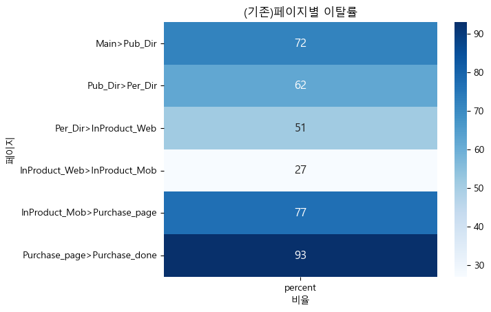

# 로그 분석을 통한 유저 행동 분석

### 1 프로젝트 소개
1.1 프로젝트 개요   
* 로그 분석을 통해 웹 및 앱 애플리케이션의 사용자 행동 및 패턴을 이해하고 이를 바탕으로 애플리케이션 개선을 위한 액션을 도출하고자함.

1.2 프로젝트 소개
* 프로젝트 기간 : 2023.07.17 - 2023.07.21
* 기술 스택 : ```Python```
* 1인 프로젝트

<br> 

### 2 프로젝트 진행절차
2.1 데이터 소개
* 데이터 shape : 301861 rows × 7 columns
* columns : actiontype(문서 이용시 행동), ismydoc(내문서 해당 여부), ext(문서 확장자), sessionid(유저 식별자), documentposition(문서 이용시 위치 정보), datetime(날짜), screen(페이지 이름)
* 출처 : GitHub

2.2 데이터 전처리
* datetime은 datetime으로 타입 변환.
* 요일 컬럼 생성.
* sessionid의 경우 보기 쉽게 int로 변경.  
  
* 세션의 경우 시간이 나타나 있지 않고 날짜만 존재하기 때문에 재정의는 하지 않고 분석 진행


2.3 EDA(문제정의 : 구매완료 페이지의 높은 이탈률(93%))
* 날짜별 로그 건수에서 패턴이 보이며 주로 주말(23%)보다는 평일(77%)에 높음
<table>
    <td>
      
    </td>
    <td>
      
    </td>
</table>

* 페이지별 비율에서 main(70.82%)이 가장 높고, purchase_done(0.03%)이 가장 낮음.
* otherapp(71%)에 가장 많이 문서가 위치함.
<table>
    <td>
      
    </td>
    <td>
      
    </td>
</table>

* 2016년 7월 한달동안의 페이지별 방문수가 급격히 줄어든 것을 확인할 수 있음.
<table>
    <td>
      
    </td>
</table>

* **가설1. 이탈하는 원인 중 하나는 확장자 구버전일까?**
* Funnel 분석을 통해 확장자 버전에 따른 이탈률을 보았을 때, 상대적으로 구버전의 이탈률이 높지만, 엄청난 큰 차이가 있지는 않다.(가설1 기각 보류)
* PDF(27%), DOCX(18%), XLSX(17%) 순으로 높음.
<table>
<tr>
    <td>
      
    </td>
    <td>
      
    </td>
</tr>
<tr>
    <td>
      
    </td>
    <td>
      
    </td>
</tr>
</table>

* 리텐션율 : 한달동안 2회이상 방문한 유저의 비율은 0.81%이다.

### 3. 결론
* 단기적으로 봤을 때, 이탈률이 가장 높은 구매완료 페이지부터 개선하는 것이 가장 영향력이 있어보임.
* 리텐션율도 낮은 것으로 보아 앱 내용이나 조작 방법이 어려워 이탈 가능성이 높아짐. A/B Test를 통해 UI/UX 개선의 필요성 있음.
* 다양한 채널을 활용하여 유저가 앱을 재방문하도록 유도한다. 이메일, 소셜 미디어 및 유료 광고 등을 활용.
* 너무 다양한 확장자는 유저에게 혼란을 줄 수 있고 상대적으로 이탈률이 높기 때문에 장기간 분석을 통해서 유저들이 선호하는 확장자를 분석하여 다양성을 줄일 필요가 있음.


### 4. 한계점 및 개선사항
* 한계점
  * 2016년 7월의 데이터만 존재하고 시간 데이터는 존재하지 않는점.
  * 실제 사이트가 존재하는 것이 아니기 때문에 페이지 개선 불가.
* 개선사항
  * 고객 세분화하여 분석.
  * 추후에 직접 데이터를 수집하여 대용량의 로그 데이터 분석 시도 예정.
